# Dataset Analysis Report

## 1. Dataset Overview

The dataset is WiDS 2020 dataset which contains medical information for predicting patient mortality. Here is the summary of the dataset:

- **Total samples**: 91,713
- **Total features**: 186
- **Feature types**:
  - 178 numerical features (8 integer, 170 floating point)
  - 8 categorical features

## 2. Target Variable Analysis

The target variable is hospital_death and it shows a significant class imbalance:
- **Survival Rate**: 91.37%
- **Mortality Rate**: 8.63%

This imbalance needs to be carefully considered during model development to prevent bias against the minority.

Following figure shows the distribution of the target variable and the class imbalance can be clearly seen:

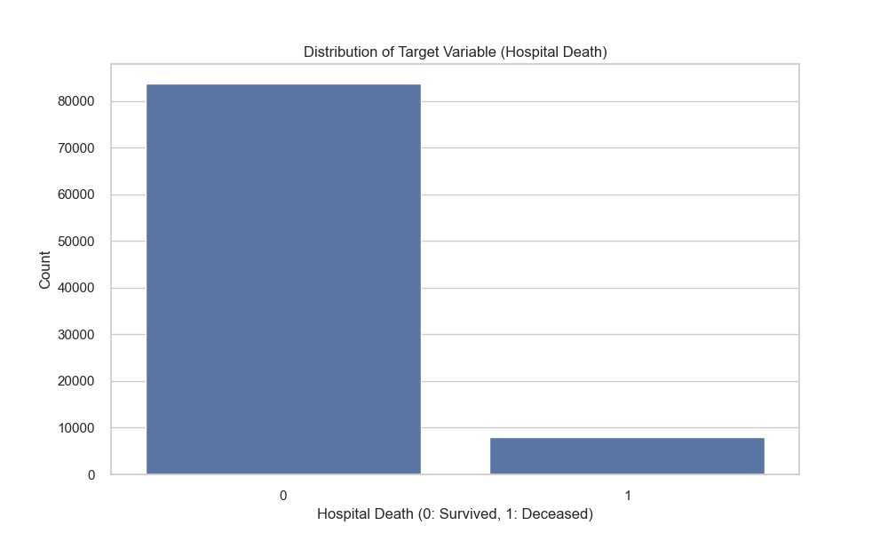

## 3. Missing Data Analysis

Most features have high percentage of missing values. 82 out of 186 features have more than 20% missing values.

Top ratios of missing values are as follows:
1. h1_bilirubin: 92.27%
2. h1_lactate: 92.00%
3. h1_albumin: 91.40%
4. h1_pao2fio2ratio: 87.44%
5. h1_arterial_ph: 83.33%

The high percentage of missing values in features could introduce selection bias, especically if the missing value patterns are not random across demographic groups such as age, gender, ethnicity etc.

## 4. Age-Related Analysis

### 4.1 Age Distribution and Mortality

The histogram shows the age distribution of patients, with mortality outcomes plotted on top of each other to show the proportion of deaths across age groups.

As can be seen, the mortality rate increases with age. However, there exist an imbalance in the age distribution, with younger patients being underrepresented in the dataset.

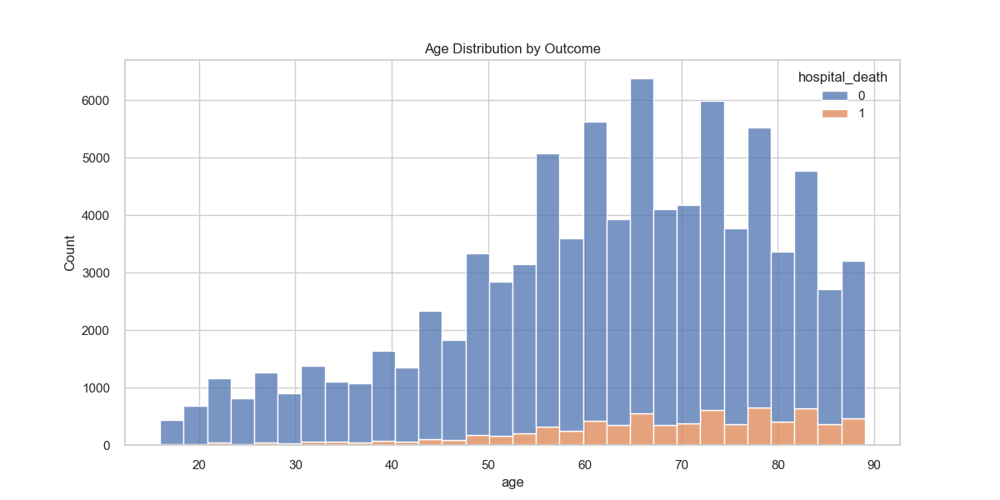

### 4.2 Mortality Rates by Age Group

The figure below shows the mortality rates across different age groups. It can be easliy seen that mortality is positively related to age.

**Summary of mortality per age group:**
- 0-18 years: 2.80%
- 19-30 years: 2.90%
- 31-45 years: 4.23%
- 46-60 years: 6.11%
- 61-75 years: 8.99%
- 75+ years: 12.60%

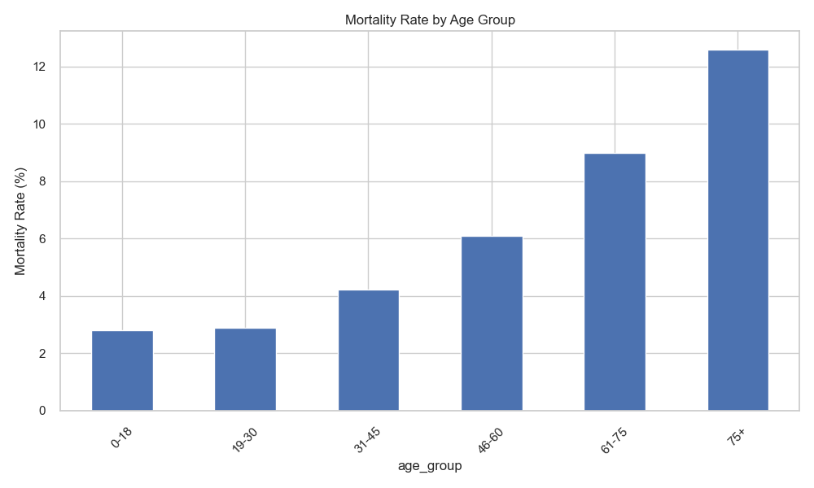

**Statistical Significance Results**:
- ANOVA results (used to understand the statistical significance of _numerical features_):
  - F-statistic: 216.66
  - p-value: < 0.0001
- This indicates highly significant differences in mortality rates across age groups.

### 4.2 Gender Analysis

There exists a small gender differences in mortality rates:
- Female mortality: 8.84%
- Male mortality: 8.44%

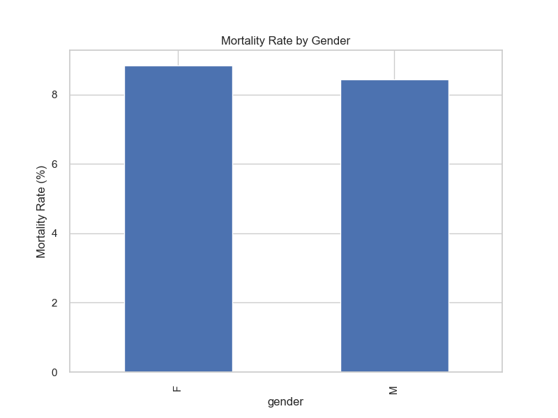

**Statistical Significance**:
- Chi-square results (used to understand the statistical significance of _categorical features_):
  - Chi-square statistic: 4.47
  - p-value: 0.0344

### 4.3 Ethnicity Analysis

Distribution and mortality rates by ethnicity:
- Caucasian: 77.07% (mortality: 8.73%)
- African American: 10.41% (mortality: 7.86%)
- Other/Unknown: 4.77% (mortality: 8.07%)
- Hispanic: 4.14% (mortality: 9.91%)
- Asian: 1.23% (mortality: 8.24%)
- Native American: 0.86% (mortality: 8.88%)

**Key Findings**:
1. Significant imbalance with Caucasian patients being the most represented ~77% of the dataset
2. Hispanic patients show the highest mortality rate (9.91%)
3. African American patients show the lowest mortality rate (7.86%)
4. The differences in mortality rates are statistically significant

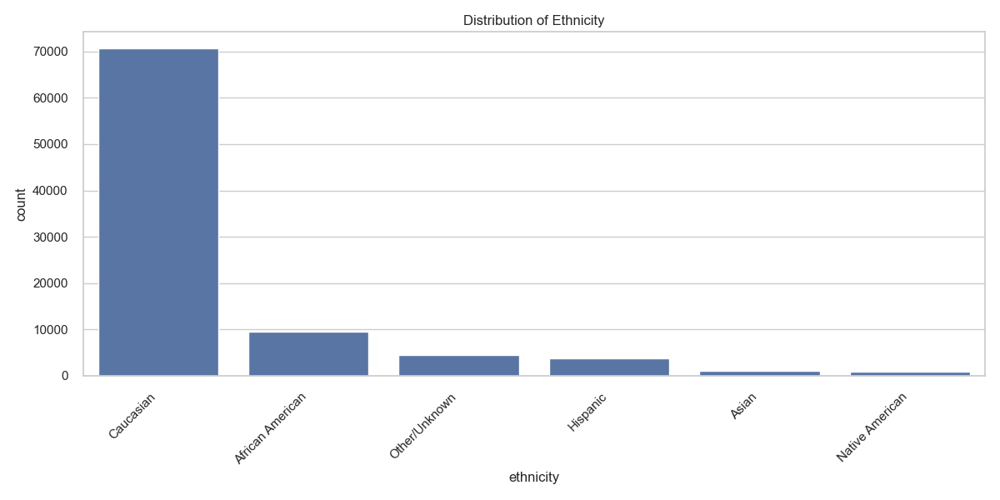

**Statistical Significance**:
- Chi-square results:
  - Chi-square statistic: 17.87
  - p-value: 0.0031
- Indicates significant differences in mortality rates across ethnic groups

### 4.4 Intersectional Analysis (Gender x Age x Mortality)

Important findings:
- Young females (0-18) have lower mortality (1.40%) compared to young males (4.19%)
- Middle-age groups have similar mortality rates across genders
- Elderly (75+) has slightly higher male mortality (12.79%) compared to females (12.41%)

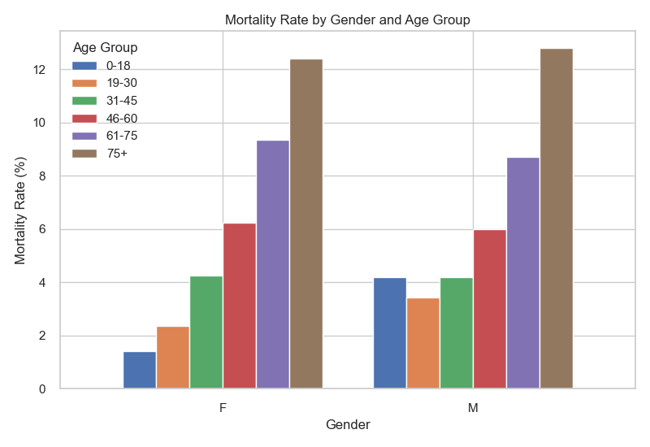

## 5. Medical Condition Analysis

### 5.1 Apache 2 Body System Distribution

Distribution and mortality rates by body system:
1. Cardiovascular: 42.32% (mortality: 10.84%)
2. Neurologic: 12.97% (mortality: 7.90%)
3. Respiratory: 12.66% (mortality: 11.21%)
4. Gastrointestinal: 9.84% (mortality: 7.42%)
5. Metabolic: 8.34% (mortality: 1.52%)
6. Other systems: <5% each

**Interesting Findings**:
1. Respiratory conditions show the highest mortality rate (11.21%)
2. Metabolic conditions show the lowest mortality rate (1.52%)
3. Cardiovascular conditions are most common (42.32% of cases)

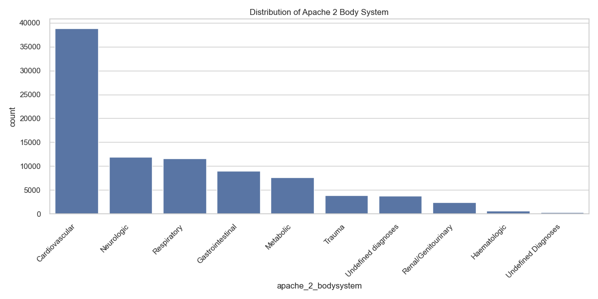

**Statistical Significance**:
- Chi-square results:
  - Chi-square statistic: 1117.50
  - p-value: < 0.0001
- This indicates significant differences in mortality rates across body systems

## 6. APACHE 4 Prediction Analysis

### 6.1 Overall Performance

Performance metrics:
- ROC AUC: 0.841
- PR AUC: 0.439

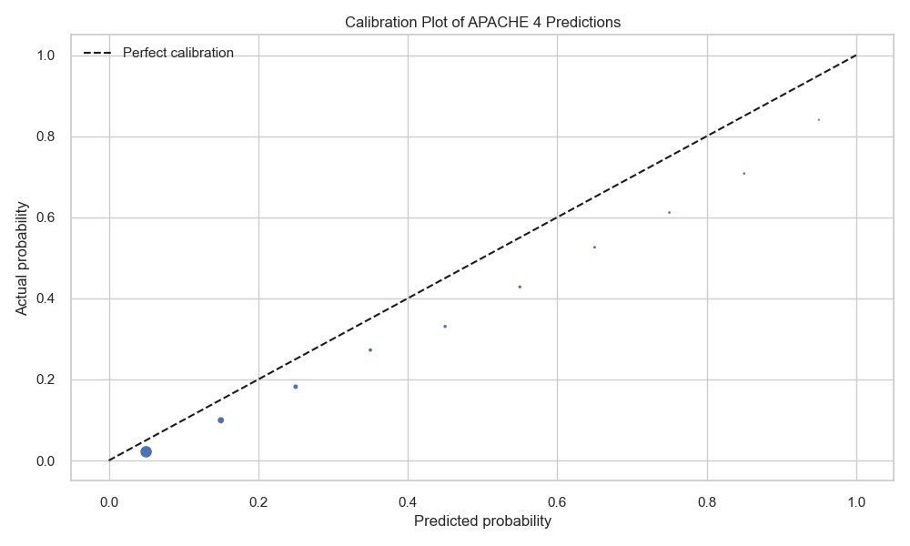

### 6.2 Bias Analysis

#### Gender Bias

- Males (number of samples = 45,245):
  - ROC AUC: 0.844
  - Mean Predicted: 8.32%
  - Actual Rate: 8.57%
- Females (number of samples = 38,502):
  - ROC AUC: 0.836
  - Mean Predicted: 9.08%
  - Actual Rate: 9.03%

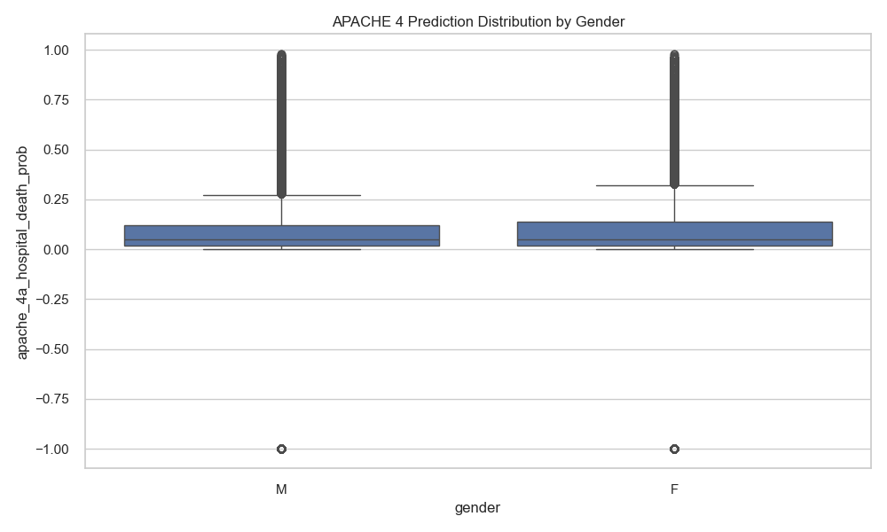

#### Ethnic Bias

Interesting findings:
- Native American patients show the highest ROC AUC (0.897)
- Hispanic patients show second-highest ROC AUC (0.865)
- Caucasian patients show lowest ROC AUC (0.836)
- Model tends to overpredict the risk for African American patients (Predicted: 9.08% vs Actual: 7.90%)

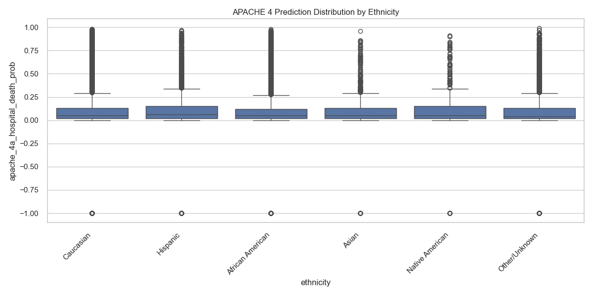

#### Body System Bias

Interesting findings:
- Highest ROC AUC for Trauma (0.879)
- Lowest ROC AUC for Respiratory (0.783)
- Significant overprediction for:
  - Respiratory (Predicted: 12.20% vs Actual: 11.43%)
  - Neurologic (Predicted: 11.14% vs Actual: 7.96%)

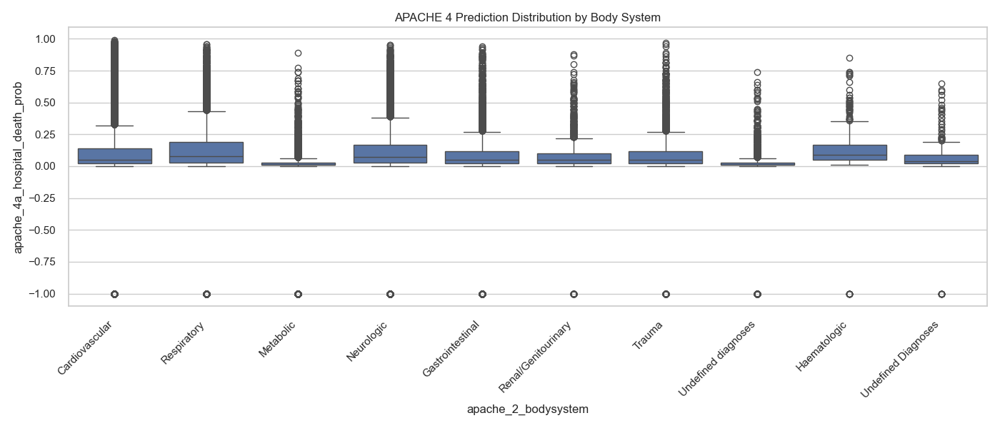

## 7. Recommendations

### 7.1 Data Collection and Missing Values
- We need to understand possible causes of missing values in medical measurements
- We need to analyze if missing value pattern correlate with sensitive attributes
- We can consider and compare multiple imputation strategies that preserve group-level statistics

### 7.2 Possible Evaluation Framework
- Evaluate fairness metrics on features like:
  - Age groups
  - Gender
  - Ethnicity
  - Body systems
  - Intersection of these groups
- Analyze false positive and false negative rates across demographic groups

## 8. Conclusion

The analysis shows potential biases across several dimensions:

1. **Demographics (Age, Gender, Ethnicity, Target Variable, Body System)**:
   - Significant class imbalance in the target variable (underrepresented mortality)
   - Age-based mortality differences
   - Underrepresentation of younger patients
   - Small but significant gender differences
   - Notable ethnic disparities in mortality rates
   - Overrepresentation of Caucasian patients
   - Overrepresentation of Cardiovascular conditions
   
2. **Medical Condition (apache_2_bodysystem)**:
   - Large variations in mortality rates across the body system feature
   - Potential interaction between demographics and medical conditions

3. **APACHE IV Evaluation**:
   - APACHE IV shows good overall discrimination (ROC AUC: 0.841)
   - But exhibits varying performance across groups
   - There exists a systematic overprediction for certain demographics and conditions